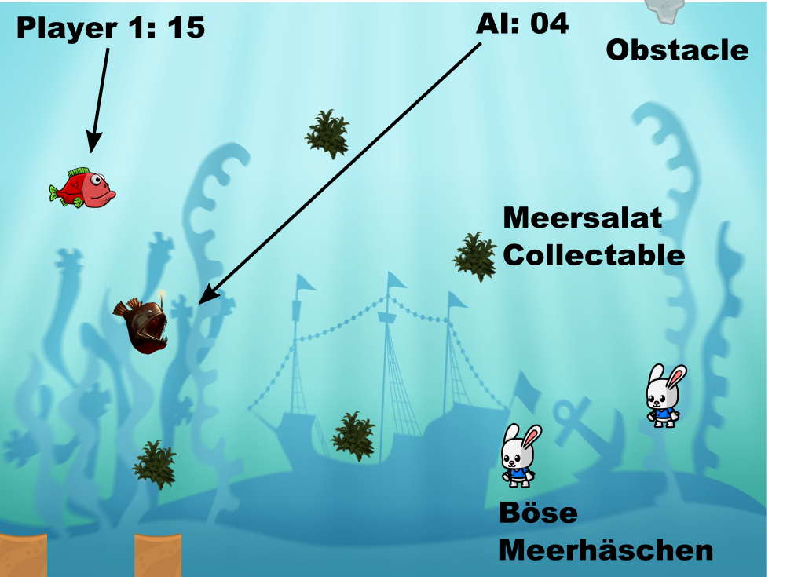

# SuperFishBros

A simple game for my daughter. 

# References

- [pygame tutorial](https://realpython.com/pygame-a-primer/)
- [Deep Reinforcement Learning](https://towardsdatascience.com/how-to-teach-an-ai-to-play-games-deep-reinforcement-learning-28f9b920440a) [https://github.com/maurock/snake-ga](Code)
- [Reinforcement Learning: Flappy Bird](https://www.toptal.com/deep-learning/pytorch-reinforcement-learning-tutorial)
- [Multi Agent Reinforcement Learning](https://www.nature.com/articles/s41586-019-1724-z.epdf?author_access_token=lZH3nqPYtWJXfDA10W0CNNRgN0jAjWel9jnR3ZoTv0PSZcPzJFGNAZhOlk4deBCKzKm70KfinloafEF1bCCXL6IIHHgKaDkaTkBcTEv7aT-wqDoG1VeO9-wO3GEoAMF9bAOt7mJ0RWQnRVMbyfgH9A%3D%3D)